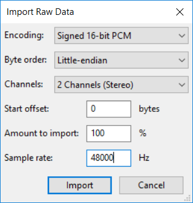
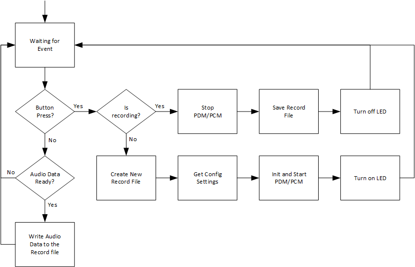

# PSoC 6 MCU: USB Mass Storage File System

This example demonstrates how to configure the USB block in a PSoC® 6 MCU device as a Mass Storage (MSC) device and run a file system ([FatFs](http://elm-chan.org/fsw/ff/00index_e.html)) through an external memory (microSD). This example uses FreeRTOS.

## Overview

In this project, the USB block in PSoC 6 MCU is configured for Mass Storage. This allows it to enumerate on the computer as a portable storage device. The firmware implements a file system (FatFs) on an external memory - microSD. You can directly access files and folders through the Operating System (OS) running as the USB host. The firmware also provides a simple button interface to start and stop audio recordings from sampling PDM microphones and writing the audio data to the file system.

To see the Mass Storage descriptor, use the `usbdev-configurator` tool located at *<ModusToolbox_install_dir>/tools_<version>/usbdev-configurator*. In the tool, open the *design.cyusbdev* file located under the */COMPONENT_CUSTOM_DESIGN_MODUS/<target>* folder. 

## Requirements

- [ModusToolbox™ software](https://www.cypress.com/products/modustoolbox-software-environment) v2.1
- Programming Language: C
- Associated Parts: All [PSoC 6 MCU](http://www.cypress.com/PSoC6) parts with USB

## Supported Kits

- [PSoC 6 Wi-Fi BT Prototyping Kit](https://www.cypress.com/CY8CPROTO-062-4343W) (CY8CPROTO-062-4343W) - Default target
- [PSoC 62S2 Wi-Fi BT Pioneer Kit](https://www.cypress.com/CY8CKIT-062S2-43012) (CY8CKIT-062S2-43012)

## Hardware Setup

This example uses the board's default configuration. See the kit user guide to ensure that the board is configured correctly.

When using CY8CKIT-062S2-43012 as the target, PDM microphone needs to be connected externally on P10.5 and P10.4 pins. This can be done by plugging in the [CY8CKIT-028-EPD](https://www.cypress.com/documentation/development-kitsboards/e-ink-display-shield-board-cy8ckit-028-epd) E-ink Shield Display board to the board’s Arduino headers.

It also requires a microSD card to properly run a file system.

## Software Setup

Install a terminator emulator if you don't have one. Instructions in this document use [Tera Term](https://ttssh2.osdn.jp/index.html.en).

This example uses the [Audacity](https://www.audacityteam.org/) tool to import raw audio data stored in the external memory. You can also use any software tool that is able to import raw audio data.

## Using the Code Example

### In Eclipse IDE for ModusToolbox:

1. Click the **New Application** link in the Quick Panel (or, use **File** > **New** > **ModusToolbox Application**).

2. Pick a kit supported by the code example from the list shown in the **Project Creator - Choose Board Support Package (BSP)** dialog.

   When you select a supported kit, the example is reconfigured automatically to work with the kit. To work with a different supported kit later, use the **Library Manager** to choose the BSP for the supported kit. You can use the Library Manager to select or update the BSP and firmware libraries used in this application. 
   
   To access the Library Manager, right-click the application name from the Project Workspace window in the IDE, and select **ModusToolbox** > **Library Manager**. You can also access it from the **Quick Panel**.

   You can also just start the application creation process again and select a different kit.

   If you want to use the application for a kit not listed here, you may need to update the source files. If the kit does not have the required resources, the application may not work.

3. In the **Project Creator - Select Application** dialog, choose the example.

4. Optionally, update the **Application Name** and **Location** fields with the application name and local path where the application is created.

5. Click **Create** to complete the application creation process.

For more details, see the Eclipse IDE for ModusToolbox User Guide: *{ModusToolbox install directory}/ide_{version}/docs/mt_ide_user_guide.pdf*.

### In Command-line Interface (CLI):

1. Download and unzip this repository onto your local machine, or clone the repository.

2. Open a CLI terminal and navigate to the application folder.

   On Linux and macOS, you can use any terminal application. On Windows, navigate to the modus-shell directory (*{ModusToolbox install directory}/tools_\<version>/modus-shell*) and run *Cygwin.bat*.

3. Import the required libraries by executing the `make getlibs` command.

### In Third-party IDEs:

1. Follow the instructions from the [CLI](#in-command-line-interface-cli) section to download or clone the repository, and import the libraries using the `make getlibs` command.

2. Export the application to a supported IDE using the `make <ide>` command.

3. Follow the instructions displayed in the terminal to create or import the application as an IDE project.

For more details, see the "Exporting to IDEs" section of the ModusToolbox User Guide: *{ModusToolbox install directory}/ide_{version}/docs/mtb_user_guide.pdf*.

## Operation

1. Connect the board to your PC using the provided USB cable through the KitProg3 USB connector.

2. Open a terminal program select the KitProg3 COM port. Set the serial port parameters to 8N1 and 115200 baud.

3. Insert a microSD card in the SD slot. Refer to the kit's guide to its location. 

4. Program the board.

   - **Using Eclipse IDE for ModusToolbox**:

      1. Select the application project in the Project Explorer.

      2. In the **Quick Panel**, scroll down, and click **\<Application Name> Program (KitProg3)**.  

   - **Using CLI**:

     From the terminal, execute the `make program` command to build and program the application using the default toolchain to the default target. You can specify a target and toolchain manually:
      ```
      make program TARGET=<BSP> TOOLCHAIN=<toolchain>
      ```

      Example:
      ```
      make program TARGET=CY8CPROTO-062-4343W TOOLCHAIN=GCC_ARM
      ```

      **Note**:  Before building the application, ensure that the *deps* folder contains the BSP file (*TARGET_xxx.lib*) corresponding to the TARGET. Execute the `make getlibs` command to fetch the BSP contents before building the application.  

      After programming, the application starts automatically. Confirm that the title of the code example and some additional messages are printed as shown below:

      ```
      ************* CE230360 - PSoC 6 MCU: USB Mass Storage File System *************


      Creating a new config.txt file... done!

      List of records:
      <Empty>
      ```

5. If any error occurs on creating files or folders, you can force the firmware to format the file system: 

   1. Keep the kit user button pressed and then press the kit reset button.

   2. Release the kit user button after a few seconds. 
     
       You should get the following message:

      ```
      ************* CE230360 - PSoC 6 MCU: USB Mass Storage File System *************


      Formatting file system... done!

      Creating a new config.txt file... done!

      List of records:
      <Empty>
      ```

6. Now, record audio data to the file system: 

   1. Press the kit user button to start recording. 
   
      The kit LED should turn on indicating that the device is recording. 
      
   2. Press the kit user button again to stop the recording. 
      
      You should get the following message:

      ```
      Started a new record with:
      SAMPLE_RATE = 48000
      SAMPLE_MODE = stereo
      -- Record ended ---
      File created: PSOC_RECORDS/rec_0001.raw
      ```

7. Connect another USB cable (or reuse the same cable to program the kit) to the USB device connector (see the kit user guide for its location). Note that the enumeration process might take a few seconds.

8. On the computer, verify that the OS recognizes a new portable device. 

   If the device does not recognize a file system, you can force the firmware to format it, as described in Step 5.

9. Open the Audacity software and do the following:
   
   1. Go to **File** > **Import** > **Raw Data...**. 
   
   2. Navigate to the USB drive and select the *PSOC_RECORDS/rec_0001.raw* file (or any other in the *PSOC_RECORDS* folder). Note that reading from the USB drive might take a few seconds, specially if the file is very large. 
   
      By default, the sample rate is set to be *48000 Hz* and sample mode to *stereo*. The **Encoding** is fixed to *Signed 16-bit PCM* and **Byte order** to *Little-endian*, as shown in [Figure 1]().

   **Figure 1. Import Window**

   

   3. Once imported, play the recorded data to your computer speaker.

10. (Optional) Edit the *config.txt* file in the USB drive to change the sample settings. 
   
     For example, change its content to:

      ```
      # Set the sample rate in Hertz
      SAMPLE_RATE_HZ=16000

      # Sample mode (stereo, mono)
      SAMPLE_MODE=mono   
      ```

11. Press the kit user button to start recording again. Stop after a few seconds. You should get the following message:

      ```
      Started a new record with:
      SAMPLE_RATE = 16000
      SAMPLE_MODE = mono
      -- Record ended ---
      File created: PSOC_RECORDS/rec_0002.raw
      ```

12. Repeat Step 9, but set the sample rate to *16000 Hz* and sample mode to *mono*.

In addition to manipulating the recorded files, you can copy new files, create new folders, and delete the content in the USB drive through the OS, as any other storage device.

## Debugging

You can debug the example to step through the code. In the IDE, use the **\<Application Name> Debug (KitProg3)** configuration in the **Quick Panel**. For more details, see the "Program and Debug" section in the Eclipse IDE for ModusToolbox User Guide: *{ModusToolbox install directory}/ide_{version}/docs/mt_ide_user_guide.pdf*.

## Design and Implementation

This code example uses the FreeRTOS on the CM4 CPU. The following tasks are created in *main.c*:

- **Audio Task**: handles the creation of audio records.
- **USB Task**: handles the USB communication.

The firmware also uses a mutex (*rtos_fs_mutex*) to control accesses to the file system by these two tasks. FatFs is the chosen file system library to enable manipulating files in this code example. The FatFs library files are located in the *fatfs* folder. The low-level layer used by the library to access the PSoC 6 MCU driver is implemented in the *fatfs/disk.c* file. PSoC 6 MCU uses the SD Host interface to communicate with the microSD card.

In the *USB task*, the USB Device block is configured to use the MSC Device Class. The task constantly checks if any USB requests are received. It bridges the USB with the file system, allowing the computer to view all files in the microSD card. The *usb_msc* folder contains all the related USB implementation as follows: 

File | Description
----|---------
*usb_scsi.h/c* |  Implements the USB SCSI protocol, which is used by the USB MSC Device Class
*usb_comm.h/c* | Implements the USB MSC Device Class requests
*cy_usb_dev_msc.h/c* | Implements the USB Device Middleware for the USB MSC Device Class (these files will eventually move to *usbdev.lib*)

In the *Audio task*, the firmware initializes the audio file system. It checks whether a FAT file system is available in the external memory. If not, it formats the memory and create a new FAT file system. It also creates a default *config.txt* file that contains audio settings, and a folder called *PSOC_RECORDS* to store new audio records. You can also force a format of the file system by pressing the kit user button during the initialization of the firmware (after a power-on-reset or hardware reset).

The *config.txt* allows you to edit two settings - sample rate and sample mode. The recommended audio sample rates are 8, 16, 32, and 48 kHz. The sample mode can be mono or stereo. This file can be modified through the computer once the device enumerates as a portable device. 

The *Audio task* also checks for kit button presses, which can start or stop a recording, depending on the current state. An LED turns on when a recording is in progress. When a new record starts, the firmware creates a new file in the *PSOC_RECORDS* folder. It starts as *rec_0001.raw*. If the file already exists, it increases the number on the file name and attempts again to create the file. If it succeeds, it gets the sample settings from *config.txt* and initializes the PDM/PCM block based on that.

Once a recording is in progress, the PDM/PCM block generates periodic interrupts to the CPU, indicating that new audio data is available. A ping-pong mechanism is implemented to avoid any corruption between the data the PDM/PCM block generates and the data the firmware manipulates. Once the data is available, the *Audio task* writes the raw audio data to the open *rec_xxxx.raw* file. 

When the user presses the kit user button again, the recording stops and the file is saved. The user can access this file through the USB Mass Storage device and use a software like Audacity to import it and play it. [Figure 2]() shows the flowchart of the *Audio Task*.

   **Figure 2. Audio Task Flowchart**

   

### Resources and Settings

**Table 1. Application Resources**
| Resource  |  Alias/Object     |    Purpose     |
| :------- | :------------    | :------------ |
| USBDEV (PDL) | CYBSP_USBDEV   | USB Device configured with Mass Storage Descriptor |
| UART (HAL) | cy_retarget_io_uart_obj | UART HAL object used by Retarget-IO for printing to the console |
| GPIO (HAL)    | CYBSP_USER_BTN         | User Button to start/stop recordings   |
| GPIO (HAL)    | CYBSP_USER_LED | User LED to turn on when recording |
| PDM/PCM (HAL) | pdm_pcm | To interface with digital microphones |
| SDHC (HAL) | sdhc_obj | SD Host to interface with the microSD card|

## Related Resources

| Application Notes                                            |                                                              |
| :----------------------------------------------------------- | :----------------------------------------------------------- |
| [AN228571](https://www.cypress.com/AN228571) – Getting Started with PSoC 6 MCU on ModusToolbox | Describes PSoC 6 MCU devices and how to build your first application with ModusToolbox |
| [AN221774](https://www.cypress.com/AN221774) – Getting Started with PSoC 6 MCU on PSoC Creator | Describes PSoC 6 MCU devices and how to build your first application with PSoC Creator |
| [AN215656](https://www.cypress.com/AN215656) – PSoC 6 MCU: Dual-CPU System Design | Describes the dual-CPU architecture in PSoC 6 MCU, and shows how to build a simple dual-CPU design |
| **Code Examples**                                            |                                                              |
| [Using ModusToolbox](https://github.com/cypresssemiconductorco/Code-Examples-for-ModusToolbox-Software) | [Using PSoC Creator](https://www.cypress.com/documentation/code-examples/psoc-6-mcu-code-examples) |
| **Device Documentation**                                     |                                                              |
| [PSoC 6 MCU Datasheets](https://www.cypress.com/search/all?f[0]=meta_type%3Atechnical_documents&f[1]=resource_meta_type%3A575&f[2]=field_related_products%3A114026) | [PSoC 6 Technical Reference Manuals](https://www.cypress.com/search/all/PSoC%206%20Technical%20Reference%20Manual?f[0]=meta_type%3Atechnical_documents&f[1]=resource_meta_type%3A583) |
| **Development Kits**                                         | Buy at www.cypress.com                                       |
| [CY8CPROTO-062-4343W](https://www.cypress.com/CY8CPROTO-062-4343W) PSoC 6 Wi-Fi BT Prototyping Kit | [CY8CKIT-062S2-43012](https://www.cypress.com/CY8CKIT-062S2-43012) PSoC 62S2 Wi-Fi BT Pioneer Kit | 
| **Libraries**                                                 |                                                              |
| PSoC 6 Peripheral Driver Library (PDL) and docs                    | [psoc6pdl](https://github.com/cypresssemiconductorco/psoc6pdl) on GitHub |
| Cypress Hardware Abstraction Layer (HAL) Library and docs          | [psoc6hal](https://github.com/cypresssemiconductorco/psoc6hal) on GitHub |
| RetargetIO - A utility library to retarget the standard input/output (STDIO) messages to a UART port | [retarget-io](https://github.com/cypresssemiconductorco/retarget-io) on GitHub |
| **Middleware**                                               |                                                              |
| CapSense library and docs                                    | [capsense](https://github.com/cypresssemiconductorco/capsense) on GitHub |
| Links to all PSoC 6 MCU Middleware                           | [psoc6-middleware](https://github.com/cypresssemiconductorco/psoc6-middleware) on GitHub |
| **Tools**                                                    |                                                              |
| [Eclipse IDE for ModusToolbox](https://www.cypress.com/modustoolbox)     | The multi-platform, Eclipse-based Integrated Development Environment (IDE) that supports application configuration and development for PSoC 6 MCU and IoT designers.             |
| [PSoC Creator](https://www.cypress.com/products/psoc-creator-integrated-design-environment-ide) | The Cypress IDE for PSoC and FM0+ MCU development.            |

## Other Resources

Cypress provides a wealth of data at www.cypress.com to help you select the right device, and quickly and effectively integrate it into your design.

For PSoC 6 MCU devices, see [How to Design with PSoC 6 MCU - KBA223067](https://community.cypress.com/docs/DOC-14644) in the Cypress community.

## Document History

Document Title: *CE230360* - *PSoC 6 MCU: USB Mass Storage File System*

| Version | Description of Change |
| ------- | --------------------- |
| 1.0.0   | New code example      |

------

All other trademarks or registered trademarks referenced herein are the property of their respective owners.


-------------------------------------------------------------------------------

© Cypress Semiconductor Corporation, 2020. This document is the property of Cypress Semiconductor Corporation and its subsidiaries ("Cypress"). This document, including any software or firmware included or referenced in this document ("Software"), is owned by Cypress under the intellectual property laws and treaties of the United States and other countries worldwide. Cypress reserves all rights under such laws and treaties and does not, except as specifically stated in this paragraph, grant any license under its patents, copyrights, trademarks, or other intellectual property rights. If the Software is not accompanied by a license agreement and you do not otherwise have a written agreement with Cypress governing the use of the Software, then Cypress hereby grants you a personal, non-exclusive, nontransferable license (without the right to sublicense) (1) under its copyright rights in the Software (a) for Software provided in source code form, to modify and reproduce the Software solely for use with Cypress hardware products, only internally within your organization, and (b) to distribute the Software in binary code form externally to end users (either directly or indirectly through resellers and distributors), solely for use on Cypress hardware product units, and (2) under those claims of Cypress's patents that are infringed by the Software (as provided by Cypress, unmodified) to make, use, distribute, and import the Software solely for use with Cypress hardware products. Any other use, reproduction, modification, translation, or compilation of the Software is prohibited.  
TO THE EXTENT PERMITTED BY APPLICABLE LAW, CYPRESS MAKES NO WARRANTY OF ANY KIND, EXPRESS OR IMPLIED, WITH REGARD TO THIS DOCUMENT OR ANY SOFTWARE OR ACCOMPANYING HARDWARE, INCLUDING, BUT NOT LIMITED TO, THE IMPLIED WARRANTIES OF MERCHANTABILITY AND FITNESS FOR A PARTICULAR PURPOSE. No computing device can be absolutely secure. Therefore, despite security measures implemented in Cypress hardware or software products, Cypress shall have no liability arising out of any security breach, such as unauthorized access to or use of a Cypress product. CYPRESS DOES NOT REPRESENT, WARRANT, OR GUARANTEE THAT CYPRESS PRODUCTS, OR SYSTEMS CREATED USING CYPRESS PRODUCTS, WILL BE FREE FROM CORRUPTION, ATTACK, VIRUSES, INTERFERENCE, HACKING, DATA LOSS OR THEFT, OR OTHER SECURITY INTRUSION (collectively, "Security Breach"). Cypress disclaims any liability relating to any Security Breach, and you shall and hereby do release Cypress from any claim, damage, or other liability arising from any Security Breach. In addition, the products described in these materials may contain design defects or errors known as errata which may cause the product to deviate from published specifications. To the extent permitted by applicable law, Cypress reserves the right to make changes to this document without further notice. Cypress does not assume any liability arising out of the application or use of any product or circuit described in this document. Any information provided in this document, including any sample design information or programming code, is provided only for reference purposes. It is the responsibility of the user of this document to properly design, program, and test the functionality and safety of any application made of this information and any resulting product. "High-Risk Device" means any device or system whose failure could cause personal injury, death, or property damage. Examples of High-Risk Devices are weapons, nuclear installations, surgical implants, and other medical devices. "Critical Component" means any component of a High-Risk Device whose failure to perform can be reasonably expected to cause, directly or indirectly, the failure of the High-Risk Device, or to affect its safety or effectiveness. Cypress is not liable, in whole or in part, and you shall and hereby do release Cypress from any claim, damage, or other liability arising from any use of a Cypress product as a Critical Component in a High-Risk Device. You shall indemnify and hold Cypress, its directors, officers, employees, agents, affiliates, distributors, and assigns harmless from and against all claims, costs, damages, and expenses, arising out of any claim, including claims for product liability, personal injury or death, or property damage arising from any use of a Cypress product as a Critical Component in a High-Risk Device. Cypress products are not intended or authorized for use as a Critical Component in any High-Risk Device except to the limited extent that (i) Cypress's published data sheet for the product explicitly states Cypress has qualified the product for use in a specific High-Risk Device, or (ii) Cypress has given you advance written authorization to use the product as a Critical Component in the specific High-Risk Device and you have signed a separate indemnification agreement.  
Cypress, the Cypress logo, Spansion, the Spansion logo, and combinations thereof, WICED, PSoC, CapSense, EZ-USB, F-RAM, and Traveo are trademarks or registered trademarks of Cypress in the United States and other countries. For a more complete list of Cypress trademarks, visit cypress.com. Other names and brands may be claimed as property of their respective owners.
